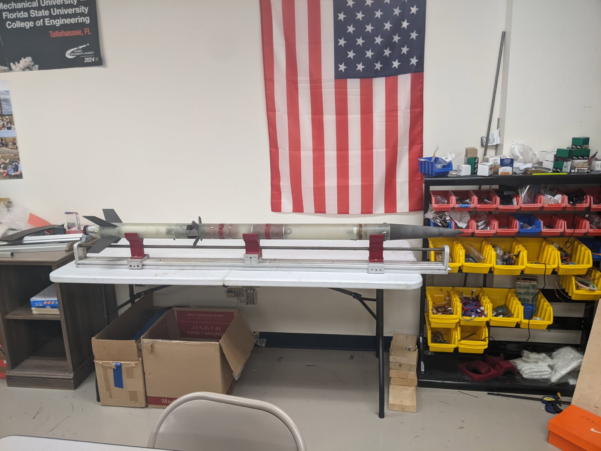
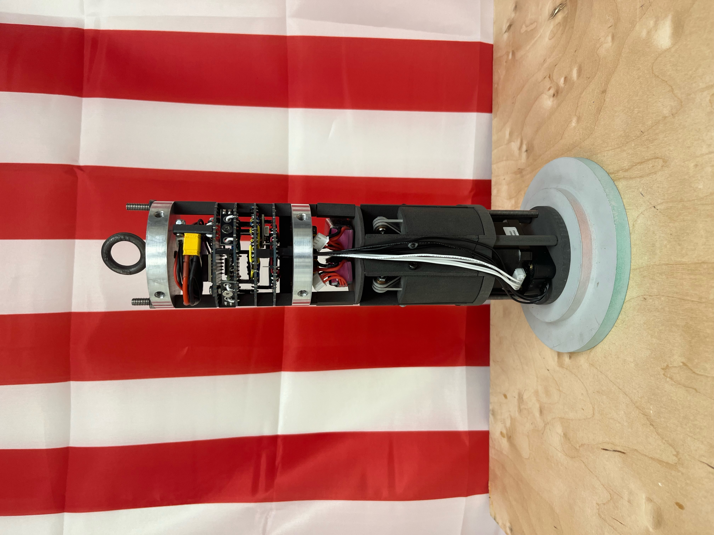
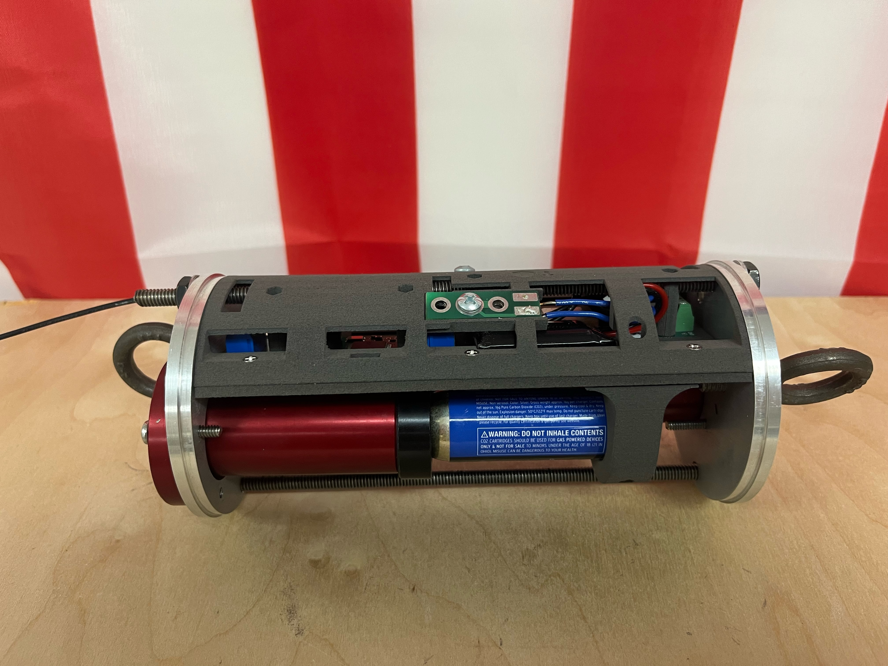

# 2024 - 2025 Airbrakes Project

The Airbrakes Project was an initiative within the Zenith Program, a rocketry club at Florida State University, to develop a drag-based apogee control system for high power rockets. Throughout the project, the Airbrakes team developed control algorithims, wrote flight software, constructed control surfaces with supporting electronics, overhauled an existing recovery system, and integrated all components into a complete system. This repository contains the source code for the flight software, hardware in the loop simulation, and supporting tools used for the 2024-2025 Airbrakes Project. Additionally, documentation for some airbrakes systems is provided for future teams' reference. 

## Repository Structure

```bash

├── include/                    # Header files
│   ├── airbrakes/              # Airbrakes specific header files
│   └── ...                     # RocketOS generic flight software header files
├── src/                        # Source code
│   ├── RocketOSfilename.cpp    # RocketOS generic flight software source files
│   ├── Airbrakesfilename.cpp   # Airbrakes specific source files
│   └── main.cpp                # Flight software entry point
├── Tools/                      # HIL simulation system and other supporting tools
│   ├── MATLAB/                 # HIL Simulink model & supporting tools
│   └── Python/                 # HIL CLI
└── Docs/                       # System documentation
```

## Flight Software Overview

- **Target Platform**: [Teensy 4.1](https://www.pjrc.com/store/teensy41.html) (ARM Cortex-M7)
- **Language**: C++
- **Environment/Toolchain**: [PlatformIO](https://docs.platformio.org/en/latest/boards/teensy/teensy41.html)
- **Features**: Real time control syatem, launch event detection, sensor firmware, telemetry logging, persistent settings, command line interface & hardware in the loop compatability.

## Required Hardware
The airbrakes flight computer consists of other modules besides teensy 4.1: 
- **MS5706 Barometric Altimeter**: Connected to Teensy 4.1's SPI0. Purchased from [Paralax Inc](https://www.parallax.com/product/altimeter-module-ms5607/).
- **BNO085 IMU**: Connected to Teensy 4.1's SPI1. Purchased from [Adafruit Industries](https://www.adafruit.com/product/4754).
- **MP6500 Stepper Motor Driver**: Look at [source code](RocketOS/src/AirbrakesActuator.cpp) to determine pinouts. Purchased from [Pololu](https://www.pololu.com/product/2968).
- **STP-LE17-2A06ADJ**: Stepper motor that drives the airbrakes. Purchased from [Automation Driect](https://www.automationdirect.com/adc/shopping/catalog/motion_control/stepper_motor_linear_actuators/stepper_motor_linear_actuators/stp-le17-2a06adj)

## Future Teams' Reference
The airbrakes module is most likely still in the 2024-2025 subscale vehicle. To interact with it, follow the usage guide and the command line interface reference manual, both of which are located in the [Docs](RocketOS/Docs) folder. The airbrakes flight software is in very good condition and contains several modules that were designed to be easily reused by future systems. These are the [Shell](RocketOS/include/shell), [Persistent](RocketOS/include/persistent), [Telemetry](RocketOS/include/telemetry), [Simulation](RocketOS/include/simulation), and [Processing](RocketOS/include/processing). Other systems, such as the hardware implementations for the [MS5607](RocketOS/src/AirbrakesSensors_Altimeter.cpp), [BNO085](RocketOS/src/AirbrakesSensors_IMU.cpp) and [MP6500](RocketOS/src/AirbrakesActuator.cpp) can likely be incorporated with minimal effort. If you have any questions, use the contact info in the Teams: *ZenithProgram\4. 24-25 Documentation\7. Airbrakes Project\4. Contact Info*.

## Media

### Airbrakes Demonstration Vehicle

### Airbrakes Module

### Avionics Bay

### Hardware in the Loop Simulation


